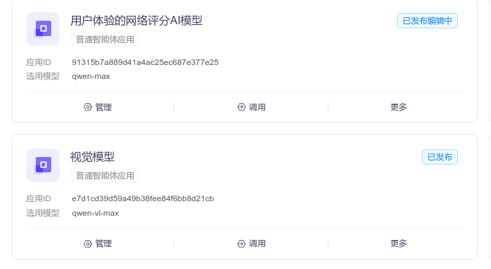
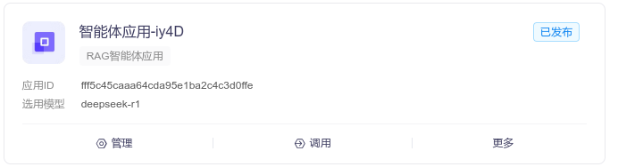

# AI 聊天框架页面

---

## 项目简介

vue3+AI+chat项目基于 **Vue3 + SpringBoot3** 技术栈，仿照 DeepSeek 官网设计并实现了一套现代化的 AI 对话系统。在原有功能基础上，对 UI 界面进行了深度美化，同时引入了多种大模型支持（本地部署与云端服务相结合），为用户提供高效、智能的对话体验。


---

## 软件架构

### 前端技术栈
- **Vue3**：现代化前端框架，采用组合式 API 提升开发效率。
- **Vite**：新一代构建工具，提供极速开发体验。
- **Pinia**：轻量级状态管理库，用于全局状态管理。
- **Element-Plus**：基于 Vue3 的组件库，提供丰富的 UI 组件。
- **Element-Plus-X**：扩展组件库，进一步简化 AI 对话界面开发。
- **JavaScript**：核心编程语言，确保代码灵活性和可维护性。

### 后端技术栈
- **SpringBoot3**：快速构建 RESTful API，提供高效的后端服务。
- **SpringAI**：集成 AI 模型的开发框架，支持流式数据处理。
- **Maven**：依赖管理工具，简化项目构建流程。
- **Redis**：高性能缓存数据库，用于存储会话信息和上下文数据。
- **MySQL**：关系型数据库，用于持久化用户数据和配置信息。

### 大模型支持
- **本地部署模型**：
  - `deepseek:7b`：基础对话模型，适合中小型企业使用。
  - `deepseek-r1`：推理模型，专为复杂逻辑推理任务设计。
- **阿里云百联平台模型**：
  - `qwen-max`：通义千问最新版大模型，具备强大的自然语言处理能力。
  - `qwen-vl-max`：通义视觉大模型，支持图片内容理解和分析。

---

## 安装教程

### 前端环境搭建

#### 前置条件
- **Node.js**：推荐使用最新稳定版本（v20+）。
- **pnpm**：高性能包管理工具（可通过 `npm install -g pnpm` 安装）。

#### 安装步骤
1. 克隆项目到本地：
   ```sh
   https://github.com/qzwujinpei/ai-chat.git
   ```
2. 安装依赖：
   ```sh
   pnpm i
   ```
3. 启动开发服务器：
   ```sh
   pnpm dev
   ```
4. 浏览器访问：
   默认地址为 `http://localhost:5173`。

---

### 后端环境搭建

#### 前置条件
- **JDK 17+**：SpringBoot3 需要 JDK 17 或更高版本。
- **Maven 3.9+**：用于构建后端项目。
- **MySQL**：数据库服务，需提前安装并启动。
- **Redis**：缓存服务，需提前安装并启动。

#### 安装步骤
1. 导入 SQL 文件：
   将项目根目录下的 `sql` 文件夹中的脚本导入 MySQL 数据库。
   
2. 配置 `application-dev.yaml` 文件：
   - 数据库连接信息：
     ```yaml
     spring:
       datasource:
         url: jdbc:mysql://host.docker.internal:3306/aichat?useSSL=false&serverTimezone=UTC
         username: root
         password: aa123456
     ```
     
   - Redis 配置：
     ```yaml
     spring:
       redis:
         host: host.docker.internal
         port: 6379
     ```
     
   - 大模型配置：
     - **Ollama**（本地模型）：
       在命令行输入 `ollama list` 查看可用模型名称，并在配置文件中填写对应模型名。
       
     - **阿里云百炼平台**：
       
       - `api-key`：填写您在阿里云平台上申请的 API 密钥。
       - `base-url`：固定为 `https://dashscope.aliyuncs.com/compatible-mode`。
       - `chat.options.model`：指定调用的模型名称（如 `qwen-max` 或 `qwen-vl-max`）。
         
       
       
       
       > 一定要在阿里云平台上创建相应的模型！！！

---

## 功能说明

### 核心功能
1. **图片理解**：
   - 用户上传图片时，自动调用 `qwen-vl-max` 视觉模型进行内容解析。
2. **流式输出**：
   - 使用 `fetch` 替代 `axios`，简化流式数据输出实现。
3. **模型切换**：
   - 支持动态切换不同大模型，满足多样化需求。

### 配置文件
- **前端配置**：
  - `src/settings.js`：配置全局变量，包括 API 地址、默认模型等。
  - `src/styles/variable.scss`：定义全局样式变量，方便统一调整布局和主题。

- **后端配置**：
  - `application-dev.yaml`：集中管理数据库、Redis 和大模型相关配置。

---

## 参考资料

1. **黑马程序员**：SpringBoot + DeepSeek 实战课程。
2. **Element-Plus-X 开发团队**：提供高效、易用的 AI 对话组件。
3. **阿里云百炼平台**：[官方文档](https://help.aliyun.com/document_detail/XXXXX.html)

---

## 参与贡献

欢迎各位开发者参与项目改进！如果您有任何建议或发现了问题，请通过以下方式联系我们：
- 提交 Issue 或 Pull Request 至项目仓库。
- 联系邮箱wujinpei@189.cn

---

## 版权声明

本项目遵循 MIT 开源协议，允许自由使用、修改和分发。但请务必保留原始版权声明和作者信息。


